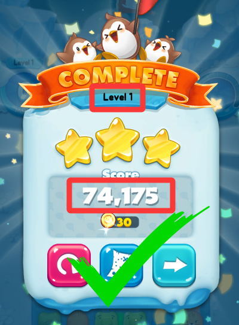
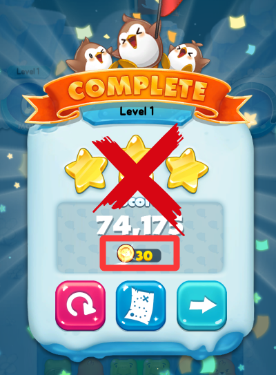
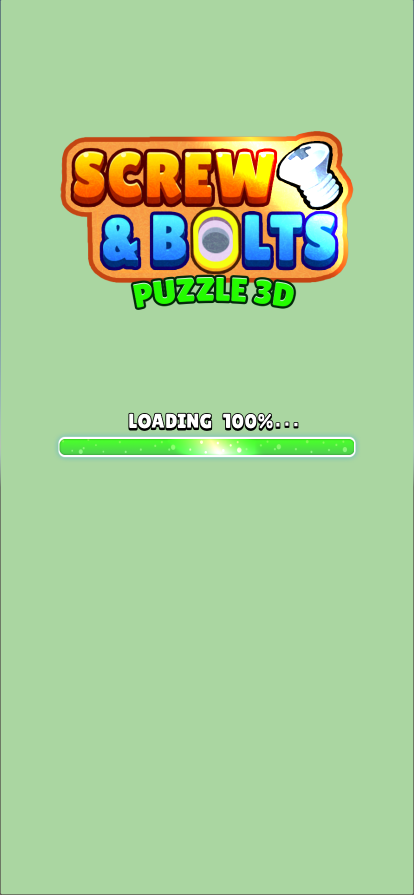
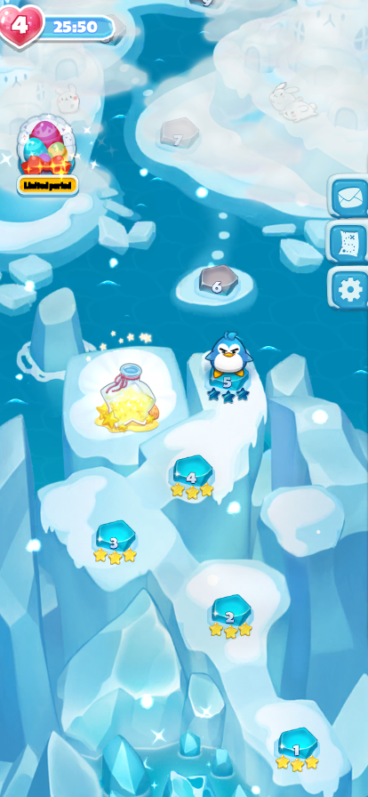
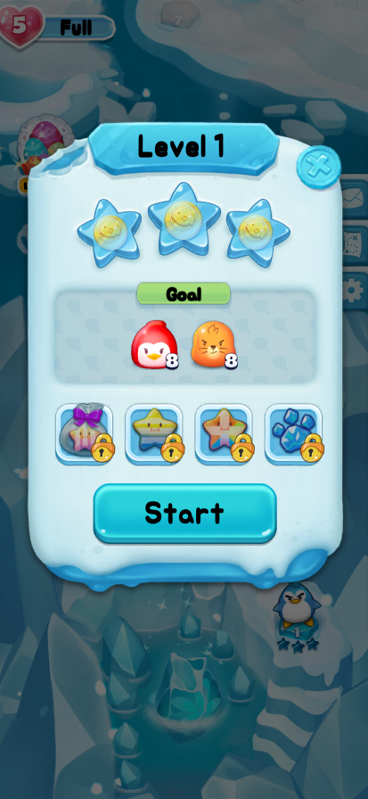
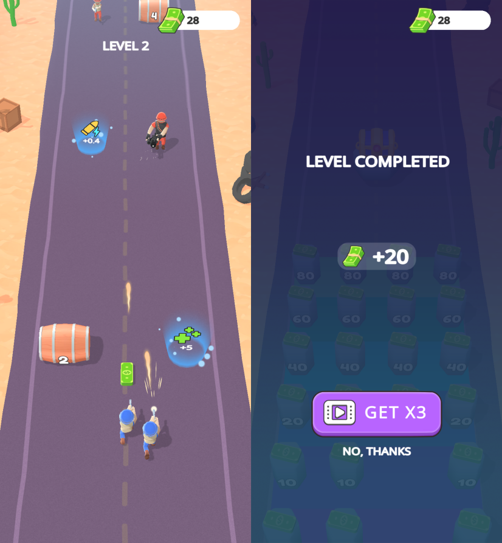
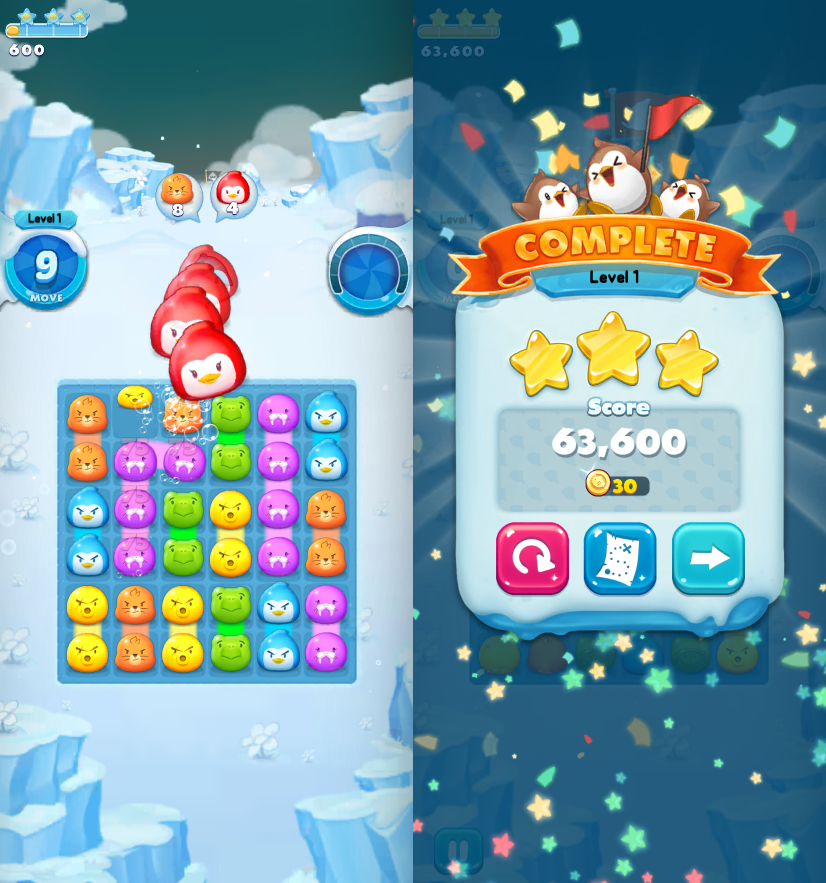
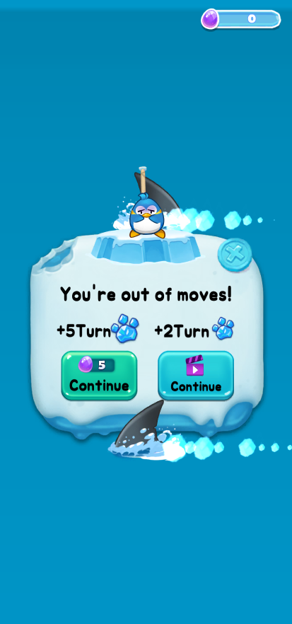
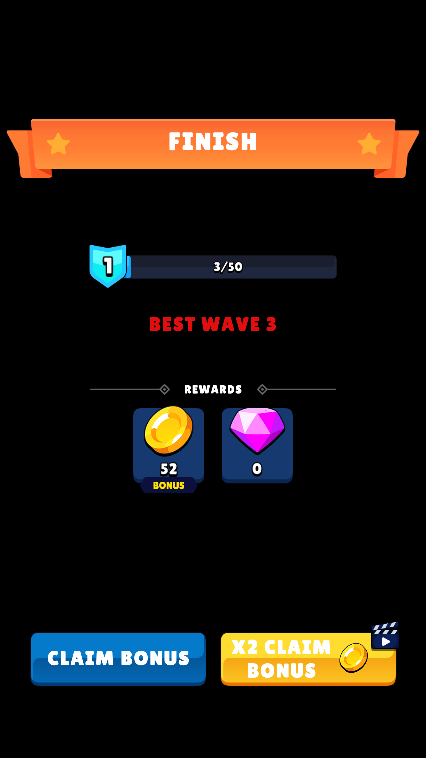
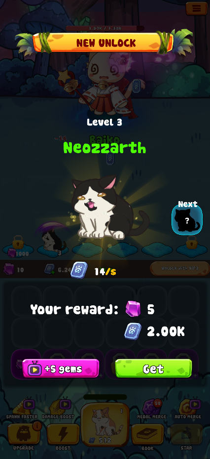

# 进度与成长数据采集规范

本文档定义了 Jolibox JS SDK 中**关卡与成长进度**相关事件的采集标准。
核心目标是准确记录用户的**不可回退进度**（如关卡、等级、最高分），以支持留存率、关卡难度及成长节奏的分析。

## 1. 核心原则

采集对象必须是**代表用户成长进度的不可逆数据**，严禁混入可消费资源。

*   **✅ 采集对象（进度）**：关卡 ID、最高分、星级、主城等级、段位。
*   **❌ 排除对象（资产）**：金币、钻石、体力、道具数量。

| 正确示范 (Good) | 错误示范 (Bad) |
| :---: | :---: |
|  |  |
| **Level 1** (关卡) / **74,175** (分数) | **金币 30** (消费资产) |

## 2. 应用交互事件定义与采集标准

### 2.1 loadFinished (游戏加载完成)

这个事件用于 “游戏资源已经准备好了”。请根据游戏是否有**首页加载进度条**来选择调用时机：



#### 情况一：没有首页进度条

如果游戏启动后直接进入主界面，请在资源加载完毕后**直接调用**。

```javascript
runtime.loadFinished();
```

#### 情况二：有首页加载进度条

如果游戏有 Loading 界面，请在**进度条走到 100%（加载完毕）** 之后调用。

```javascript
// 1. 加载过程中同步进度（可选）
runtime.notifyLoadProgress(30);
runtime.notifyLoadProgress(60);
// ...

// 2. 加载完毕后，立即调用完成信号
runtime.loadFinished();
```

### 2.2 gameTTI (首次进入用户交互屏)

这个事件用于记录游戏**首次变得可交互**的时间点（Time to Interactive）。

*   **什么时候传**：当用户**第一次**看到主界面，且**可以点击**任何 UI 元素（如开始按钮、设置图标等）的时候。
*   **注意**：只传一次，通常在游戏启动进入首页后立即调用。



```javascript
// 主界面加载完毕，且 UI 按钮可以响应点击时
runtime.gameTTI();
```

## 3. 游戏内事件定义与采集标准

### 3.1 onLevelStart (关卡开始)

适用于有关卡概念的游戏。

*   **什么时候传**：当玩家点击“开始”或正式进入关卡时触发。
*   **传什么**：当前开始的关卡号。



```javascript
// 比如点击了 Level 1 的 Start 按钮
await task.onLevelStart({ 
    levelId: 1       // 必传：当前所在的关卡/层数 
});
```

### 3.2 onLevelFinished (关卡完成)

这个事件主要分两种情况：

#### 情况一：有关卡概念的游戏（如闯关、消消乐）

这类游戏通常是一关一关过的。

*   **什么时候传**：只有在**「通关成功」**的时候回传一次。
*   **传什么**：把当前通过的关卡号（levelId）传上来就行。
*   **注意**：失败了或者中途退出了，**不要传**。



```javascript
// 比如刚过了第 1 关
await task.onLevelFinished({
    levelId: 1,     // 必传：当前通过的关卡号
});
```

#### 情况二：有分数概念的游戏（如跑酷、无尽模式）

这类游戏可能显示的也是“Level”，但核心其实是比分数或者跑多远。

*   **什么时候传**：每一局游戏**正常结束**（结算面板出来）时回传一次。
*   **传什么**：把这局的结果（分数、米数等）传上来。



```javascript
// 比如这局跑完结算了
await task.onLevelFinished({
    levelId: 1,      // 必传：当前所在的关卡/层数
    score: 63600,         //可选： 本局拿到的核心分数（比如金钱/米数）
    rating: 3,         // 可选：拿了几颗星
    duration: 120000   //可选： 本局坚持了多久(毫秒)
});
```

### 3.3 onLevelFailed (关卡失败)

适用于有关卡概念的游戏。当玩家在关卡中**失败**（如步数耗尽、死亡）且决定放弃或重新开始时触发。

*   **什么时候传**：关卡失败结算面板出现时。
*   **传什么**：当前失败的关卡号，以及（可选的）当前进度或分数。



```javascript
await task.onLevelFailed({ 
    levelId: 1,        // 必传：当前所在的关卡/层数 
    score: 200,        // 可选：本局拿到的核心分数（比如金钱/米数） 
    rating: 0,         // 可选：拿了几颗星 
    duration: 120000   // 可选：本局坚持了多久(毫秒) 
});
```

### 3.4 onGamePlayEnded (单局结束)

适用于单局循环、无明确关卡结构的玩法（如跳一跳、跑酷、无尽模式）。无论输赢，只要结算面板弹出即触发。



#### 字段映射说明

1.  **BEST WAVE 3 (score)**：本局核心成绩，对应图中 "BEST WAVE 3"。
2.  **Duration (duration)**：本局存活时长（毫秒）。
3.  **Rating (rating)**：(可选) 胜负状态或评价等级。

#### 代码示例

```javascript
await task.onGamePlayEnded({
    score: 3,          // 对应 BEST WAVE 3
    duration: 120000,  // 存活时长(ms)
    rating: 1          // 结果标记
});
```

### 3.5 onLevelUpgrade (等级提升)

适用于长线成长内容（如 RPG 等级、主城升级、段位晋升），或**没有明确关卡但有核心单位等级**的游戏（如合成类游戏的最高猫咪等级）。



#### 采集规则

*   **场景示例**：如图所示，游戏中没有关卡概念，但玩家解锁了新的猫咪等级（Level 3）。此时应将**当前解锁的最高等级**上报。
*   **触发时机**：升级/解锁新等级的瞬间触发。
*   **去重机制**：同一等级仅上报一次（需本地记录已上报的最高等级）。
*   **单调性**：仅记录升级，不记录降级或掉段。

#### 代码示例

```javascript
// 当玩家解锁了 Level 3 的猫咪时
await task.onLevelUpgrade({
    levelId: 3,           // 新解锁的最高等级
    name: "Neozzarth"       // 等级名称/角色名(可选)
});
```

## 4. 常见问题 (FAQ)

**Q: 关卡失败是否需要上报 `onLevelFinished`？**
> 不需要。该事件仅用于记录“通过”行为。失败数据请上报 `onLevelFailed` 事件。

**Q: 重复挑战已通关的关卡是否上报？**
> 需要上报。凡是真实的通关行为均应记录，用于分析用户活跃度与重复挑战意愿。

**Q: 为什么不能上报金币或道具数量？**
> 金币属于波动性资产，无法代表用户的成长进度。将其混入进度数据会导致用户分层逻辑失效。
